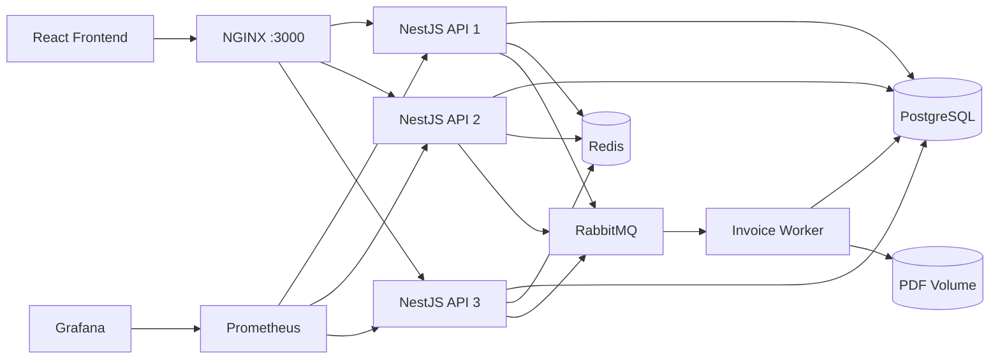

# Jewelry SaaS

Jewelry SaaS is a multi-tenant jewelry shop management platform for inventory,
pricing, customers, sales, and operational reporting. It combines a React
frontend with a horizontally scaled NestJS API, tenant-scoped data access, and
asynchronous invoice PDF generation.

## Key features

- **Inventory:** jewelry items, categories, status tracking, search, filters, and pagination
- **Pricing:** shop-specific gold rates, current-rate caching, and jewelry price calculations
- **Customers and sales:** customer records, point-of-sale flow, payments, refunds, and invoices
- **Invoice PDFs:** asynchronous generation, status tracking, retry handling, and secure download
- **Shop operations:** old-gold exchanges, custom orders, craftsmen, and audit logs
- **Reporting:** sales, inventory value, profit, gold-rate history, and daily closing summaries
- **Multi-tenancy:** shop-scoped data, JWT authentication, RBAC, shop guards, and Super Admin views

## Tech stack

| Area | Technologies |
| --- | --- |
| Frontend | React, Vite, TypeScript, Tailwind CSS, Axios, React Hook Form, Zod |
| Backend | NestJS, TypeScript, Prisma, Passport/JWT, PDFKit, NestJS Throttler |
| Database | PostgreSQL |
| Infrastructure | Docker Compose, NGINX, Redis, RabbitMQ, local PDF volume |
| Performance and testing | k6, Jest, ts-jest, Vitest, React Testing Library |
| Observability | Prometheus, Grafana, prom-client |
| CI | GitHub Actions |

## Architecture



## Running locally

### Requirements

- Node.js 20 and npm
- Docker with Docker Compose
- k6 only when running the inventory benchmark

### Start from a fresh clone

Create host-development environment files:

```powershell
Copy-Item backend/.env.example backend/.env
Copy-Item frontend/.env.example frontend/.env
```

Start the backend infrastructure. The one-shot `migrate` service builds the
shared backend image and runs `prisma migrate deploy` before the API replicas
start:

```powershell
docker compose up -d --build
```

Run the frontend outside Docker:

```powershell
cd frontend
npm ci
npm run dev
```

For backend commands executed from the host:

```powershell
cd backend
npm install
npx prisma generate
```

Application seeds are opt-in. Use the role/development/Super Admin scripts only
for the local account setup you need; the dedicated performance seed remains
separate from normal seeding.

### Local URLs

| Service | URL |
| --- | --- |
| Frontend | `http://localhost:5173` |
| API through NGINX | `http://localhost:3000` |
| Swagger | `http://localhost:3000/api/docs` in development, or when `SWAGGER_ENABLED=true` |
| Grafana | `http://localhost:3001` |
| Prometheus | `http://localhost:9090` |
| RabbitMQ management | `http://localhost:15672` |
| PostgreSQL from host | `127.0.0.1:5433` |

## Useful development commands

| Task | Directory | Command |
| --- | --- | --- |
| Backend tests | `backend` | `npm test` |
| Frontend tests | `frontend` | `npm test` |
| Backend lint check | `backend` | `npm run lint:check` |
| Backend build | `backend` | `npm run build` |
| Frontend build | `frontend` | `npm run build` |
| Prisma Studio | `backend` | `npm run prisma:studio` |
| Role seed | `backend` | `npm run seed:roles` |
| Performance dataset | `backend` | `npm run seed:performance` |
| Inventory k6 benchmark | `backend` | `npm run loadtest:inventory` |

The k6 script requires `API_BASE_URL`, `LOGIN_EMAIL`, and `LOGIN_PASSWORD`.

## Architecture highlights

- Three stateless API replicas behind round-robin NGINX
- Redis cache-aside for the current shop gold rate with TTL and invalidation
- Durable RabbitMQ invoice jobs with bounded retries, acknowledgements, and a dead-letter queue
- Background PDF generation with idempotent status transitions and shared local storage
- Prometheus metrics from every API replica with a provisioned Grafana dashboard
- Dedicated ~10,000-item performance dataset and separate 10/50/100-VU k6 scenarios
- IP-based rate limiting and graceful NestJS/Prisma shutdown
- GitHub Actions validation for pushes and pull requests

Rate limiting currently uses in-memory storage. Each API replica maintains its
own counters, so limits are per replica rather than cluster-wide.

## CI

GitHub Actions runs backend Jest tests, backend lint, frontend Vitest tests, and
both production builds. It also generates and validates Prisma artifacts and
builds the shared backend Docker image without publishing it.

CI runs on pushes to every branch and pull requests targeting `master`. It does
not run k6, start the infrastructure stack, or deploy the application.

## Current deployment

The project is not publicly deployed. The current deployment target is the local
Docker Compose architecture documented above; no cloud environment or image
registry is configured.
